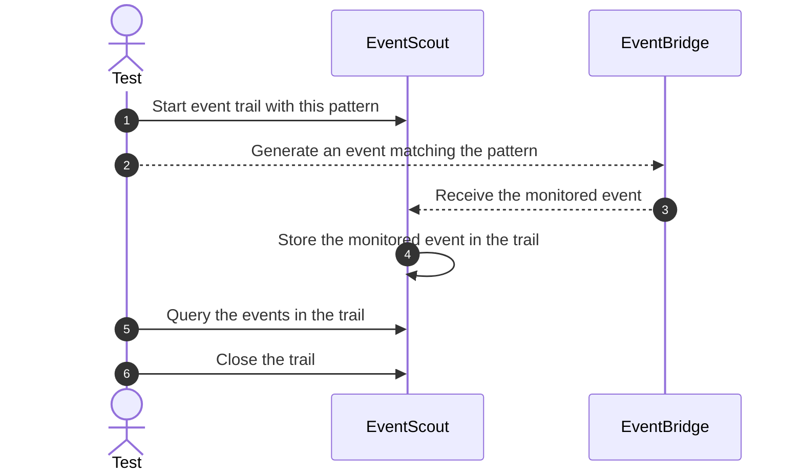

# Event Scout

Easy testing and monitoring for events flows on Amazon EventBridge.

## Why EventScout?

Debugging and testing asynchronous flows on Amazon EventBridge is hard, especially since AWS does not provide a simple way to monitor what events have transited through an Event Bus.

EventScout aims to provide this missing piece, both during development and in automated integration tests, by creating **event trails**. These trail record all events with a specific shape. You can then query the trail to see what events have transited through the bus.

For example, in an integration test, this could be used as such:

## Features

- **Monitor your events easily**: EventScout allows you to create event trails with dynamic filter patterns on EventBridge
- **Scale your integration tests**: EventScout can create unlimited parallel event trails, event with overlapping patterns, so ou can rule all your integration tests in parallel
- **Pay only for what you use**: EventScout implements a fully Serverless architecture

## Installation

In order to properly work, EventScout needs to:

- deploy the necessary resources with [@event-scout/construct](./packages/construct/README.md)
- use event trails in your tests with [@event-scout/client](./packages/client/README.md)
- monitor your events in real-time with [event-scout](./packages/event-scout/README.md) CLI

And you're all set! The power of EventScout is yours!
